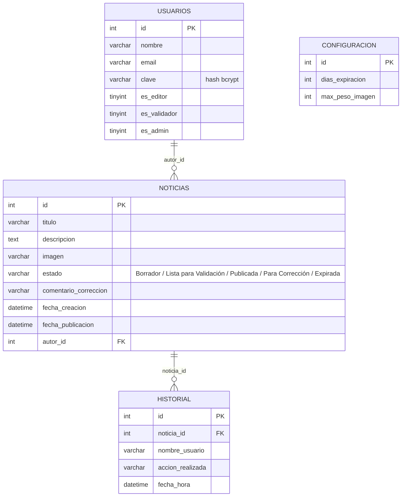

# 📰 Módulo de Publicación de Noticias Institucionales

Sistema de gestión editorial con flujo de aprobación (Borrador → Validación → Publicación) construido en PHP nativo + MySQL, sin frameworks.

**Trabajo Integrador — Parte 1** · Materia **Técnicas y Herramientas para el Desarrollo Web con Calidad** · **Tecnicatura Universitaria en Web** · Autor: **Riberi Zunino Simon**

> Este proyecto fue realizado en el marco de la carrera universitaria, puntualmente para la materia orientada a desarrollo y **testing** de aplicaciones web. No está pensado para producción: es una pieza de portfolio que muestra manejo de PHP plano, MySQL, control de acceso por roles y un flujo de negocio con múltiples estados.

---

## Tabla de contenidos

- [Descripción y propósito](#descripción-y-propósito)
- [Funcionalidades](#funcionalidades)
- [Arquitectura](#arquitectura)
- [Modelo de datos (diagrama entidad-relación)](#modelo-de-datos-diagrama-entidad-relación)
- [Stack técnico](#stack-técnico)
- [Estructura de carpetas](#estructura-de-carpetas)
- [Guía de instalación](#guía-de-instalación)
- [Limitaciones conocidas](#limitaciones-conocidas)
- [Decisiones técnicas y desafíos del desarrollo](#decisiones-técnicas-y-desafíos-del-desarrollo)

---

## Descripción y propósito

Este es un **CMS de noticias institucionales** pensado para una organización (por ejemplo, una escuela o instituto) que necesita que varias personas escriban contenido pero que nada se publique sin revisión. Implementa un circuito editorial de tres roles —**Editor**, **Validador** y **Administrador**— sobre un esquema de estados (`Borrador` → `Lista para Validación` → `Publicada` / `Para Corrección` → `Expirada`), con auditoría de cada cambio.

Se muestra aquí como **pieza de portfolio**, no como producto terminado: el objetivo fue demostrar comprensión de un patrón **MVC manual** (sin CodeIgniter, Laravel ni ningún framework), manejo de sesiones PHP, subida de archivos, hashing de contraseñas y reglas de negocio no triviales (auto-expiración, prohibición de auto-validación, historial de auditoría), todo con las herramientas base que pide la cátedra. La sección de [Limitaciones conocidas](#limitaciones-conocidas) es deliberadamente honesta: se dejaron señaladas las cosas que en un entorno real habría que corregir antes de exponer esto a internet.

## Funcionalidades

### Noticias públicas (sin login)
Cualquier visitante puede ver, en `index.php`, el listado de noticias con estado `Publicada`, ordenadas por fecha de publicación descendente.


### Login con contraseña hasheada
Autenticación por email/clave contra la tabla `usuarios`, con `password_hash()` / `password_verify()` (bcrypt). La sesión guarda el id del usuario y sus tres flags de rol (`es_editor`, `es_validador`, `es_admin`).


### Recuperación de contraseña (simulada, sin email real)
El usuario ingresa su email y, si existe, el sistema **resetea la clave a un valor fijo (`123456`)** y lo muestra en pantalla. No hay envío de correo ni PHPMailer: es un flujo pensado para un entorno local de pruebas, no para producción (ver [Limitaciones](#limitaciones-conocidas)).


### Panel por rol
Una misma vista (`panel.php`) cambia sus acciones disponibles según los flags de sesión: el Editor ve "Crear Nueva Noticia" y un botón para enviar sus borradores a validación; el Validador ve el botón "VALIDAR" sobre las noticias en `Lista para Validación`; el Administrador ve accesos a gestión de usuarios y configuración.

| Vista del Editor | Vista del Validador |
|---|---|
|  |  |

### Alta y gestión de usuarios (solo Admin)
El Administrador registra usuarios y les asigna cualquier combinación de roles (Editor / Validador / Admin) mediante checkboxes.


### Panel de administración: configuración + gestión
Desde un panel exclusivo, el Admin define los **días de expiración** de una noticia publicada y el **peso máximo de imagen** permitido (ambos se guardan en la tabla `configuracion` y se aplican dinámicamente), además de poder eliminar usuarios o noticias.


### Alta de noticias con validaciones de formulario
El Editor crea una noticia con título (10–100 caracteres), descripción (mínimo 50 caracteres) e imagen opcional. La imagen se valida contra el límite de peso configurado por el Admin antes de guardarse en disco.


### Circuito de corrección
Si el Validador rechaza una noticia con un comentario, esta vuelve a `Borrador` y el Editor ve la observación del Validador al reabrir el formulario de edición.


### Validación editorial con regla anti-autoaprobación
El Validador revisa el contenido completo (incluida la imagen) y decide **Publicar** o **Mandar a Corregir**, dejando un comentario opcional. El sistema impide que un usuario valide una noticia de la que él mismo es autor, y evita publicar dos noticias con el mismo título.


### Historial de auditoría
Cada creación, edición y cambio de estado de una noticia queda registrado con usuario, acción y fecha/hora exacta en la tabla `historial`.


### Expiración automática
Al entrar al panel, se ejecuta una consulta que marca como `Expirada` toda noticia `Publicada` cuyos días desde la publicación superen el límite configurado — no hay un cron ni un job en segundo plano, la verificación ocurre "al vuelo" en cada carga de `panel.php`.

### Cambio de contraseña propio
Cualquier usuario autenticado puede cambiar su contraseña, con confirmación de coincidencia y longitud mínima de 4 caracteres.


## Arquitectura

MVC manual en tres carpetas (`vistas/`, `controladores/`, `modelos/`), sin router ni autoload: cada vista apunta directamente al controlador que necesita por `action` del formulario, y cada controlador incluye a mano los modelos que usa.

```mermaid
flowchart TD
    Usuario((Usuario / Navegador))

    subgraph Vistas["vistas/*.php — HTML + lógica de presentación"]
        V_login[login.php]
        V_panel[panel.php]
        V_form[form_noticia.php]
        V_validar[validar_noticia.php]
        V_admin[vista_admin.php]
        V_usuarios[form_usuarios.php]
    end

    subgraph Controladores["controladores/*.php — procesan el POST y deciden"]
        C_login[loginController.php]
        C_noticia[noticiaController.php]
        C_admin[adminController.php]
        C_usuario[usuarioController.php]
        C_recuperar[recuperarController.php]
        C_clave[cambiarContraController.php]
    end

    subgraph Modelos["modelos/*.php — funciones con SQL embebido"]
        M_bd[bd.php · conexión mysqli]
        M_usuario[Usuario.php]
        M_noticia[Noticia.php]
        M_historial[Historial.php]
    end

    DB[(MySQL / MariaDB<br/>noticias_db)]

    Usuario --> V_login
    Usuario --> V_panel
    Usuario --> V_form
    Usuario --> V_validar
    Usuario --> V_admin
    Usuario --> V_usuarios

    V_login -- POST --> C_login
    V_form -- POST --> C_noticia
    V_validar -- POST --> C_noticia
    V_admin -- POST --> C_admin
    V_usuarios -- POST --> C_usuario

    C_login --> M_bd
    C_noticia --> M_noticia
    C_noticia --> M_historial
    C_admin --> M_usuario
    C_admin --> M_noticia
    C_usuario --> M_usuario
    C_recuperar --> M_bd
    C_clave --> M_bd

    M_usuario --> DB
    M_noticia --> DB
    M_historial --> DB
    M_bd --> DB

    V_panel -. "consulta SQL directa,&#10;sin pasar por modelos" .-> DB
```



> **Nota de honestidad arquitectónica:** `panel.php` e `index.php` ejecutan `mysqli_query()` directamente sobre la vista (incluyendo el `UPDATE` que expira noticias vencidas), sin pasar por la capa de modelos. Es una inconsistencia real del proyecto, no un simplificación del diagrama — queda documentada en [Limitaciones conocidas](#limitaciones-conocidas).

## Modelo de datos (diagrama entidad-relación)



> `configuracion` es una tabla de fila única (singleton, `id = 1`) sin relación con el resto; guarda parámetros globales del sistema. Ninguna de las relaciones de arriba está declarada como `FOREIGN KEY` en el esquema real — ver [Limitaciones conocidas](#limitaciones-conocidas).

## Stack técnico

| Capa | Tecnología |
|---|---|
| Lenguaje backend | PHP 8 (procedural, sin frameworks) |
| Base de datos | MySQL / MariaDB (driver `mysqli`) |
| Frontend | HTML + CSS plano (`vistas/estilos.css`), sin JS ni librerías |
| Sesiones | `$_SESSION` nativas de PHP |
| Hashing de contraseñas | `password_hash()` / `password_verify()` (bcrypt) |
| Entorno de desarrollo | XAMPP (Apache + MariaDB + phpMyAdmin) |

## Estructura de carpetas

```
.
├── index.php                  # Home pública (lista noticias "Publicada")
├── noticias_db.sql            # Dump de la base con esquema + usuario admin de ejemplo
├── controladores/             # Reciben POST/GET, validan y llaman a los modelos
│   ├── adminController.php
│   ├── cambiarContraController.php
│   ├── cerrarSesionController.php
│   ├── loginController.php
│   ├── noticiaController.php
│   ├── recuperarController.php
│   └── usuarioController.php
├── modelos/                   # Funciones de acceso a datos (SQL embebido)
│   ├── bd.php                 # Conexión mysqli (credenciales hardcodeadas)
│   ├── Historial.php
│   ├── Noticia.php
│   └── Usuario.php
├── vistas/                    # HTML + PHP de presentación
│   ├── estilos.css
│   ├── login.php
│   ├── panel.php
│   ├── form_noticia.php
│   ├── validar_noticia.php
│   ├── form_usuarios.php
│   ├── vista_admin.php
│   ├── historial_vista.php
│   ├── recuperar.php
│   └── cambiar_clave.php
├── imagenes/                  # Carpeta donde se guardan las imágenes subidas (no incluida en el repo, ver instalación)
└── docs/screenshots/          # Capturas usadas en este README
```

## Guía de instalación

1. **Requisitos**: un entorno con PHP 7.4+ y MySQL/MariaDB — lo más simple es [XAMPP](https://www.apachefriends.org/).
2. **Clonar el repositorio**
   ```bash
   git clone https://github.com/RibZu/Riberi-Simon-Paractico-Parte1.git
   ```
3. **Crear la carpeta de imágenes.** El código sube archivos a `imagenes/` en la raíz del proyecto, pero la carpeta no viaja vacía en git — creala a mano:
   ```bash
   mkdir imagenes
   ```
4. **Crear la base de datos e importar el esquema.** En phpMyAdmin (o por consola) creá una base llamada `noticias_db` e importá `noticias_db.sql`. Esto crea las 4 tablas y un usuario administrador de ejemplo.
5. **Revisar la conexión a la base.** `modelos/bd.php` asume MySQL en `localhost`, usuario `root` sin contraseña:
   ```php
   $conexion = mysqli_connect("localhost", "root", "", "noticias_db");
   ```
   Si tu entorno usa otro usuario/clave, editá ese archivo (ver [Limitaciones conocidas](#limitaciones-conocidas)).
6. **Servir el proyecto.** Copiá la carpeta completa dentro de `htdocs` (XAMPP) o levantá el servidor embebido de PHP desde la raíz del proyecto:
   ```bash
   php -S localhost:8000
   ```
7. **Acceder desde el navegador:**
   - Noticias públicas: `http://localhost:8000/index.php`
   - Ingreso al sistema: `http://localhost:8000/vistas/login.php`
8. **Credenciales de prueba** (usuario administrador incluido en el dump):
   - **Email:** `admin@mail.com`
   - **Contraseña:** `123456`

   Desde ese usuario se pueden crear los roles de Editor y Validador para probar el circuito completo.

## Limitaciones conocidas

Estas son limitaciones reales del código, dejadas a propósito sin corregir porque el objetivo del trabajo era otro (y porque mostrarlas con honestidad tiene más valor de portfolio que ocultarlas):

- **Credenciales de base de datos hardcodeadas.** `modelos/bd.php` conecta con usuario `root` y contraseña vacía escritos directamente en el código, sin variables de entorno ni archivo de configuración separado.
- **SQL armado por concatenación de strings, sin sentencias preparadas.** Todos los modelos y controladores (`Usuario.php`, `Noticia.php`, `Historial.php`, `loginController.php`, `adminController.php`, etc.) interpolan variables `$_POST`/`$_GET` directamente dentro del texto de la query. Esto expone el proyecto a **inyección SQL** — es funcional para un entorno local de pruebas, pero no debería exponerse tal cual a internet.
- **Sin protección CSRF ni sanitización de salida.** Los formularios no llevan token anti-CSRF, y datos como el título de una noticia se imprimen en las vistas sin `htmlspecialchars()`, lo que además abre la puerta a XSS reflejado/almacenado.
- **"Recuperar contraseña" no envía email.** Resetea la clave a un valor fijo (`123456`) y lo muestra en pantalla en lugar de enviarlo por correo (no hay PHPMailer ni SMTP configurado). Válido para un entorno local, inaceptable en producción.
- **Sin `FOREIGN KEY` reales en el esquema.** `noticias.autor_id` y `historial.noticia_id` son enteros sueltos; la integridad referencial (por ejemplo, borrar el historial al borrar una noticia) se resuelve a mano en el código PHP (`eliminarNoticia()`), no en la base de datos.
- **Reglas de negocio mezcladas con la vista.** `panel.php` ejecuta un `UPDATE` de expiración automática directamente en la vista, saltándose la capa de modelos — ver la nota en [Arquitectura](#arquitectura).
- **Subida de archivos sin validar tipo real ni sanitizar el nombre.** Solo se valida el peso (`$_FILES['imagen']['size']`); el nombre original del archivo se usa tal cual para guardarlo en `imagenes/`, sin chequear la extensión/mimetype ni evitar colisiones o path traversal.
- **Contraseñas de un solo factor y sin política de complejidad**, más allá de un mínimo de 4 caracteres al cambiarla.
- **Sin tests automatizados.** El "testing" del proyecto, en el marco de la materia, fue manual (ver la sección siguiente).

## Decisiones técnicas y desafíos del desarrollo

*(Extracto del informe original entregado para la cátedra.)*

- **IDE y lenguajes:** se usó Visual Studio Code por ser liviano, y PHP + HTML + CSS + SQL sin frameworks porque eran las tecnologías ya vistas en años anteriores de la tecnicatura, lo que permitió avanzar rápido sin curva de aprendizaje adicional.
- **Motor de base de datos:** MySQL/MariaDB vía XAMPP, administrado con phpMyAdmin, por su integración simple con `mysqli` y por ser ya conocido de materias anteriores.
- **Evitar títulos duplicados al publicar (Regla 4):** antes de permitir que un Validador cambie el estado a `Publicada`, se consulta si ya existe otra noticia publicada con el mismo título; si existe, se bloquea la acción.
- **Peso máximo de imagen configurable:** se agregó la tabla `configuracion` para que el peso límite (en bytes) lo defina el Administrador en vez de estar fijo en el código.
- **Expiración automática (Regla 11):** se resolvió con una verificación al entrar a `panel.php`, que marca como `Expirada` toda noticia publicada que superó los días configurados — no hay un cron job.
- **MVC manual sin framework:** separación en `vistas/`, `modelos/` y `controladores/` armada a mano, sin router ni autoload.
- **Historial de auditoría (Reglas 15 y 16):** una función `registrarHistorial()` se invoca desde los controladores cada vez que se crea, edita o cambia el estado de una noticia, guardando usuario, acción y fecha exacta.
- **Rol Administrador (supuesto agregado):** la consigna original solo mencionaba Editores y Validadores; se agregó el rol Admin para dar de alta usuarios y configurar el sistema.
- **Un usuario no puede validarse a sí mismo (supuesto agregado):** si el mismo usuario es Editor y Validador, no puede publicar sus propias noticias — siempre debe intervenir otra persona.
- **Envío manual a validación (supuesto agregado):** el Editor decide cuándo su borrador pasa a `Lista para Validación` con un botón explícito, en vez de que cualquier edición dispare el cambio de estado.
- **Comentarios de corrección (supuesto agregado):** cuando el Validador rechaza una noticia, puede dejar por escrito qué corregir; ese texto se le muestra al Editor al reabrir el formulario.
- **Mensajes vía sesión, sin JS:** los errores/éxitos de los formularios se muestran con variables de sesión (carteles rojos/verdes), para no perder los datos ya cargados por el usuario ni depender de JavaScript.
