# 📰 Módulo de Publicación de Noticias Institucionales


Sistema de gestión editorial con flujo de aprobación (Borrador → Validación → Publicación) para noticias institucionales, construido en **PHP plano + MySQL, sin frameworks**.

## 📌 Propósito

Realizado en el marco del trabajo práctico de la materia **Técnicas y Herramientas para el Desarrollo Web con Calidad** (Tecnicatura Universitaria en Web), orientada a desarrollo y **testing**. Implementa, sin frameworks, un circuito editorial con tres roles (Editor, Validador, Administrador) donde nada se publica sin revisión, con MVC manual, sesiones PHP, subida de archivos, hashing de contraseñas y reglas de negocio como auto-expiración e historial de auditoría.

## ✨ Funcionalidades

**Autenticación y usuarios**
- Login con `password_hash()` / `password_verify()` (bcrypt).
- Roles combinables por sesión: Editor, Validador, Admin.
- Alta de usuarios y roles (solo Admin).
- Recuperación de contraseña (clave temporal) y cambio de contraseña propio.

**Noticias y flujo editorial**
- Listado público de noticias publicadas, sin login (`index.php`).
- Alta de noticias con validación de longitud y peso de imagen.
- Envío manual a validación ("Enviar a Validar").
- Validación: publicar o mandar a corregir, con comentario. No se puede auto-validar ni duplicar título publicado.
- Corrección: la noticia vuelve a borrador con la observación del Validador visible.
- Expiración automática al superar los días configurados.

**Panel de administración**
- Vista única que cambia según el rol activo.
- Configuración de expiración y peso de imagen, y baja de usuarios/noticias.

**Auditoría**
- Historial por noticia: usuario, acción y fecha/hora de cada cambio.

## 📸 Capturas de pantalla

<table>
<tr>
<td align="center">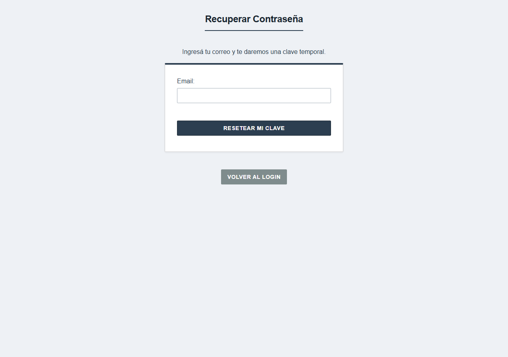<br><sub><b>Recuperar contraseña</b></sub></td>
<td align="center">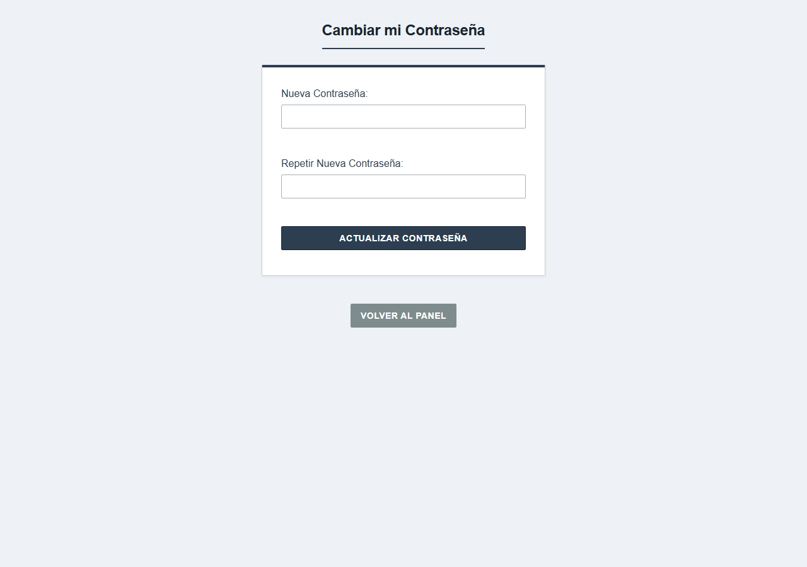<br><sub><b>Cambiar contraseña</b></sub></td>
</tr>
<tr>
<td align="center">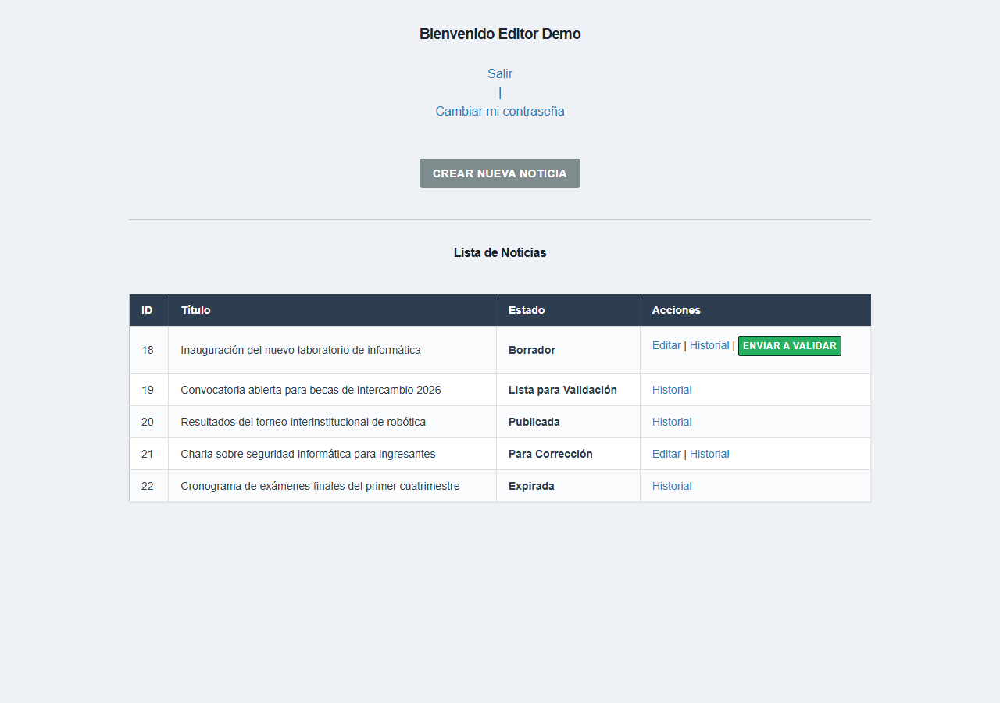<br><sub><b>Panel del Editor</b></sub></td>
<td align="center">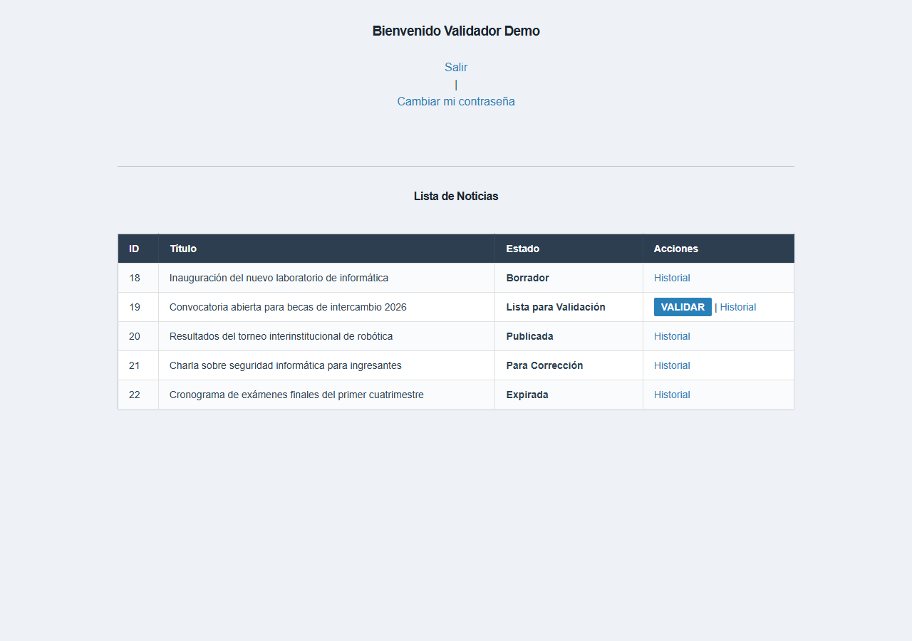<br><sub><b>Panel del Validador</b></sub></td>
</tr>
<tr>
<td align="center">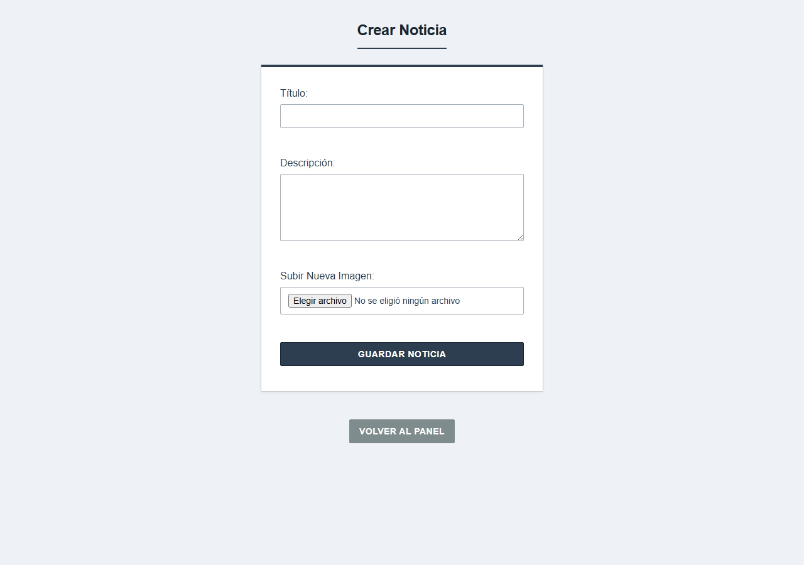<br><sub><b>Crear noticia</b></sub></td>
<td align="center">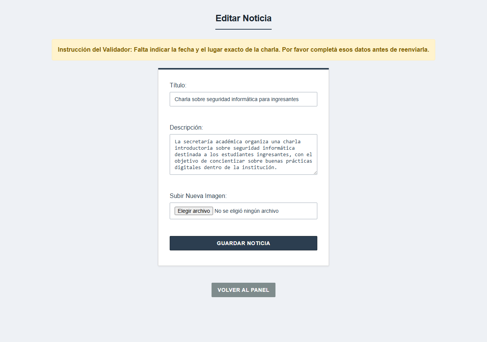<br><sub><b>Editar en corrección</b></sub></td>
</tr>
<tr>
<td align="center">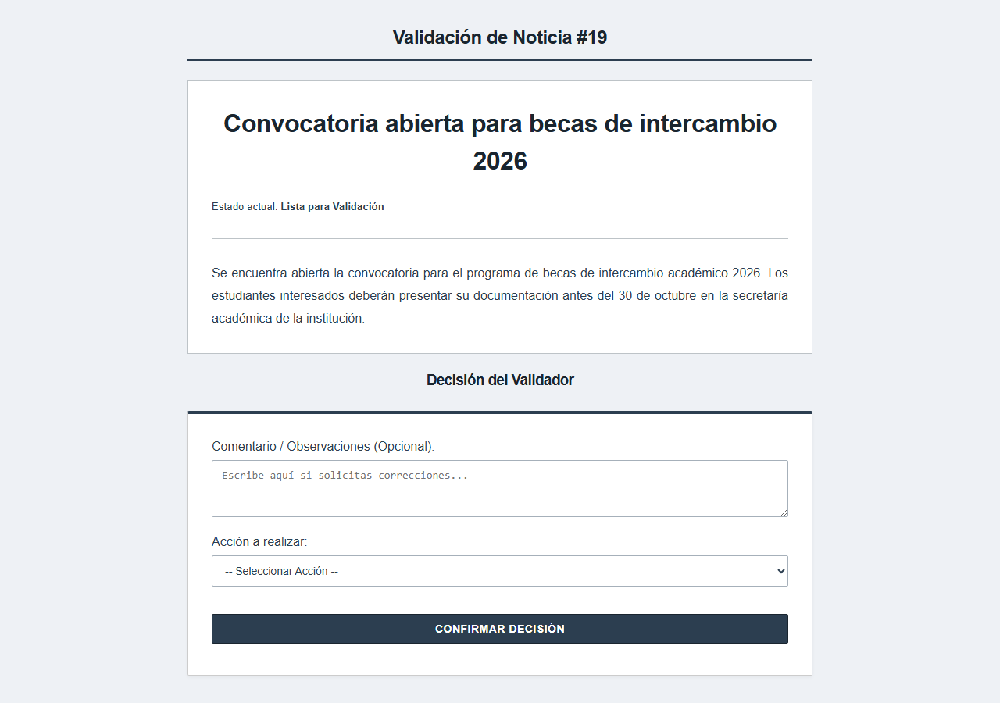<br><sub><b>Validación editorial</b></sub></td>
<td align="center">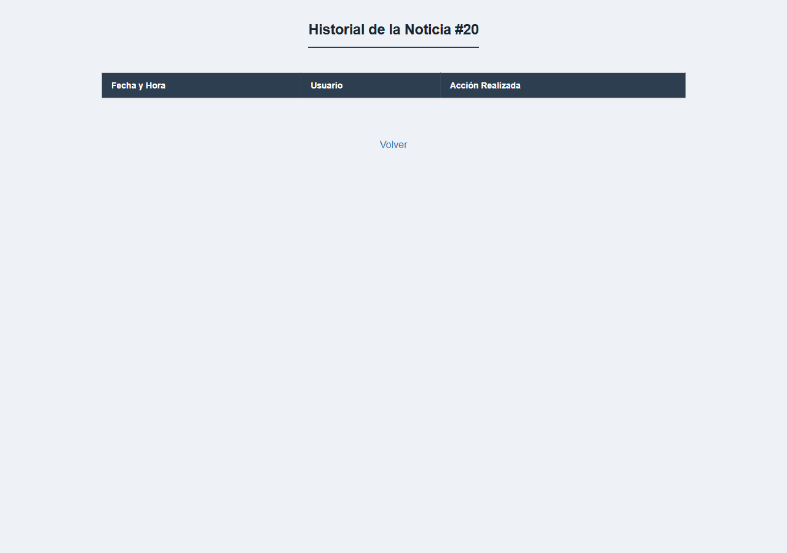<br><sub><b>Historial</b></sub></td>
</tr>
<tr>
<td align="center">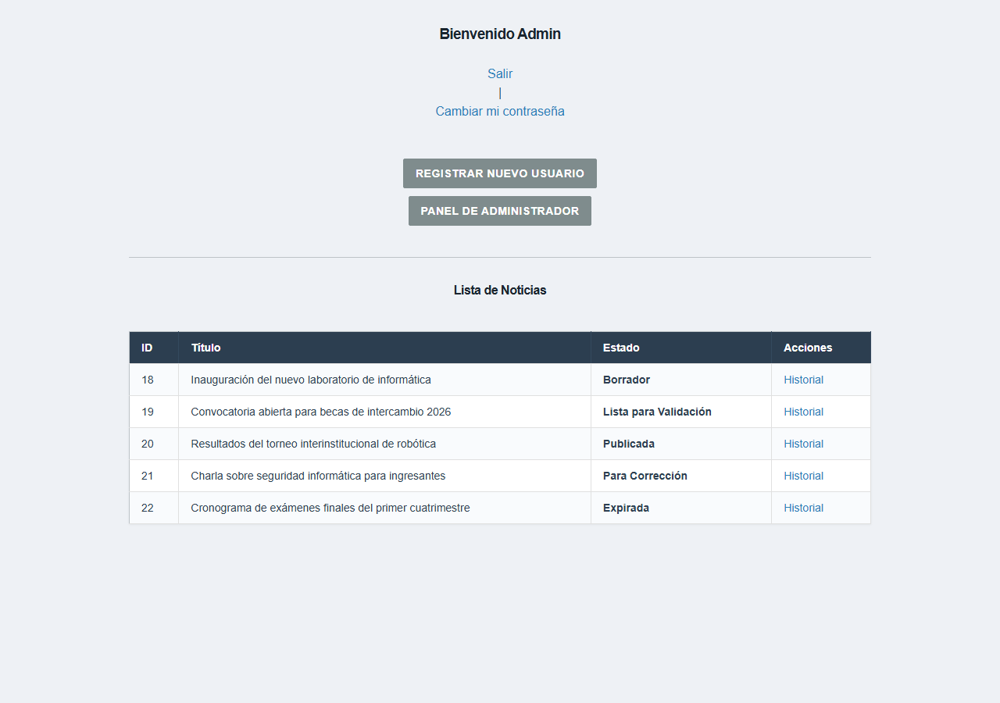<br><sub><b>Panel Admin</b></sub></td>
<td align="center">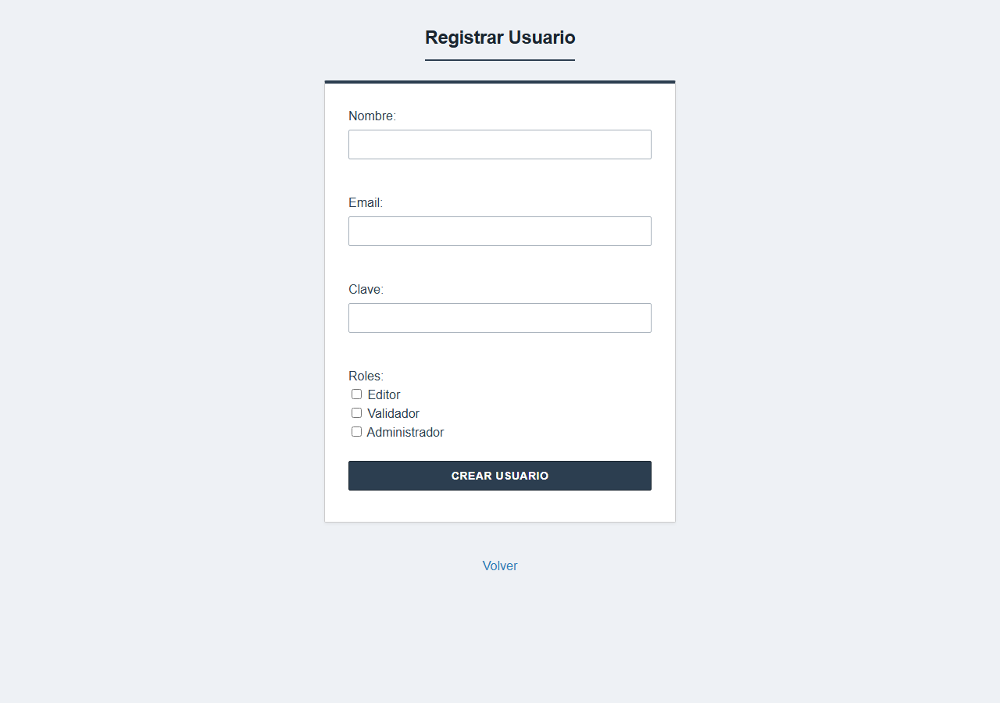<br><sub><b>Registrar usuario</b></sub></td>
</tr>
<tr>
<td align="center" colspan="2">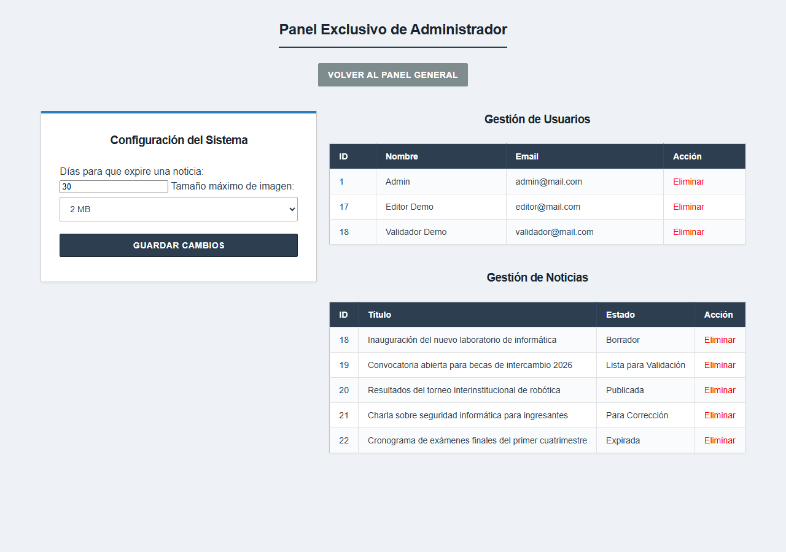<br><sub><b>Configuración y gestión (Admin)</b></sub></td>
</tr>
</table>

## 🏗️ Diagrama de arquitectura

MVC manual sin router ni autoload: cada vista llama a su controlador por `action`, y cada controlador incluye a mano los modelos que usa.

```mermaid
flowchart TD
    Usuario((Usuario / Navegador))

    subgraph Vistas["vistas/*.php"]
        V_login[login.php]
        V_panel[panel.php]
        V_form[form_noticia.php]
        V_validar[validar_noticia.php]
        V_admin[vista_admin.php]
        V_usuarios[form_usuarios.php]
    end

    subgraph Controladores["controladores/*.php"]
        C_login[loginController.php]
        C_noticia[noticiaController.php]
        C_admin[adminController.php]
        C_usuario[usuarioController.php]
        C_recuperar[recuperarController.php]
        C_clave[cambiarContraController.php]
    end

    subgraph Modelos["modelos/*.php"]
        M_bd[bd.php]
        M_usuario[Usuario.php]
        M_noticia[Noticia.php]
        M_historial[Historial.php]
    end

    DB[(MySQL / MariaDB<br/>noticias_db)]

    Usuario --> V_login & V_panel & V_form & V_validar & V_admin & V_usuarios

    V_login -- POST --> C_login
    V_form -- POST --> C_noticia
    V_validar -- POST --> C_noticia
    V_admin -- POST --> C_admin
    V_usuarios -- POST --> C_usuario

    C_login --> M_bd
    C_noticia --> M_noticia & M_historial
    C_admin --> M_usuario & M_noticia
    C_usuario --> M_usuario
    C_recuperar --> M_bd
    C_clave --> M_bd

    M_usuario & M_noticia & M_historial & M_bd --> DB

    V_panel -. "SQL directo,&#10;sin pasar por modelos" .-> DB
```

## 🗂️ Diagrama entidad-relación

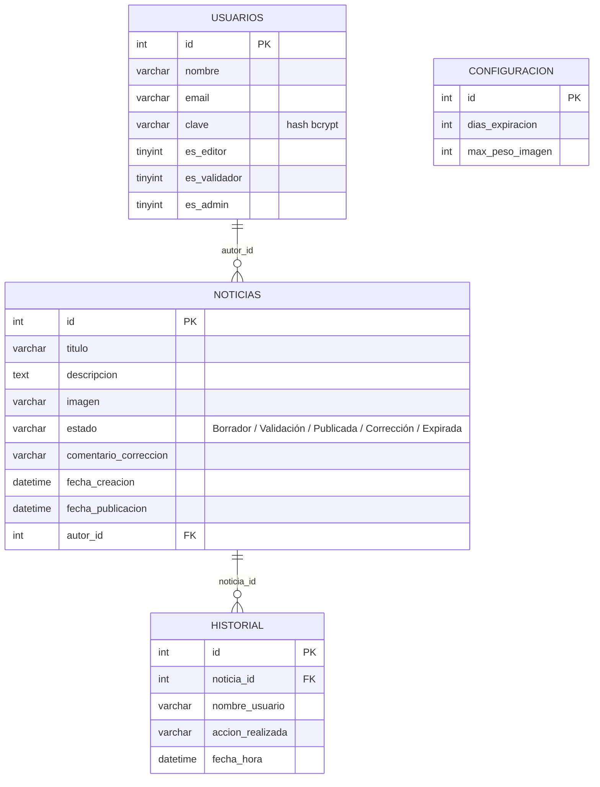

## 🛠️ Stack técnico

| Capa | Tecnología |
|---|---|
| Backend | PHP 8 (procedural, sin frameworks) |
| Base de datos | MySQL / MariaDB vía `mysqli` |
| Frontend | HTML + CSS plano, sin JS |
| Auth | Sesiones PHP + `password_hash()` |
| Entorno | XAMPP |
| Testing | Manual (ver [Limitaciones](#️-limitaciones-conocidas)) |

## 📁 Estructura de carpetas

```
.
├── index.php                  # Home pública
├── noticias_db.sql            # Esquema + usuario admin de ejemplo
├── controladores/              # Procesan POST/GET y llaman a los modelos
├── modelos/                    # Acceso a datos (SQL embebido)
│   └── bd.php                  # Conexión mysqli (credenciales hardcodeadas)
├── vistas/                     # HTML + PHP de presentación
├── imagenes/                   # Imágenes subidas (no incluida en el repo)
└── docs/screenshots/           # Capturas de este README
```

## 🚀 Instalación

1. Requisitos: PHP 7.4+ y MySQL/MariaDB (por ejemplo [XAMPP](https://www.apachefriends.org/)).
2. Clonar:
   ```bash
   git clone https://github.com/RibZu/Riberi-Simon-Paractico-Parte1.git
   ```
3. Crear la carpeta `imagenes/` (no viaja vacía en git):
   ```bash
   mkdir imagenes
   ```
4. Crear la base `noticias_db` e importar `noticias_db.sql`.
5. Revisar `modelos/bd.php` (por defecto: `root` sin contraseña) y ajustar si tu entorno es distinto.
6. Levantar el servidor desde la raíz:
   ```bash
   php -S localhost:8000
   ```
7. Acceder a `http://localhost:8000/index.php` (público) o `.../vistas/login.php` (sistema).
8. Login de prueba: **admin@mail.com** / **123456**.

## ⚠️ Limitaciones conocidas

- Credenciales de BD hardcodeadas en `modelos/bd.php`.
- SQL por concatenación, sin sentencias preparadas (riesgo de inyección SQL).
- Sin CSRF ni escape de salida (riesgo de XSS).
- Recuperación de contraseña simulada: resetea a `123456`, no envía email.
- Sin `FOREIGN KEY` reales en el esquema.
- Subida de archivos sin validar tipo real ni sanitizar el nombre.
- Sin tests automatizados; el testing fue manual.

## 📚 Decisiones técnicas

*(Resumen del informe entregado para la cátedra.)*

- VS Code + PHP/HTML/CSS/SQL sin frameworks, por ser lo ya visto en la tecnicatura.
- MySQL/MariaDB vía XAMPP y phpMyAdmin, por simplicidad con `mysqli`.
- Antes de publicar, se verifica que no exista otro título publicado igual.
- El peso máximo de imagen es configurable (tabla `configuracion`), no fijo en código.
- La expiración se resuelve al entrar al panel (sin cron), comparando fechas contra la configuración.
- Se sumó el rol Admin (no pedido explícitamente) para dar de alta usuarios y configurar el sistema.
- Un usuario no puede validar su propia noticia, aunque tenga ambos roles.
- El paso a validación es manual (botón), no automático en cada edición.
- El Validador puede dejar un comentario de corrección visible para el Editor.
- Mensajes de error/éxito vía sesión, para no perder los datos del formulario ni depender de JS.

## 📄 Licencia

Repositorio sin licencia. Se recomienda agregar una (por ejemplo MIT) antes de reutilizarlo como base.
